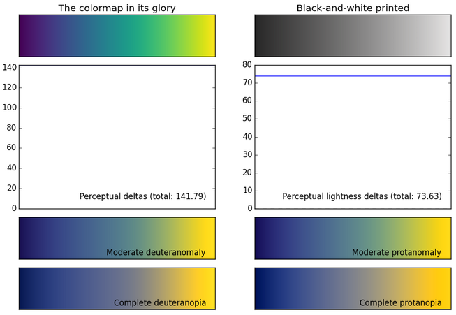

```{r, echo = FALSE, message=FALSE, warning=FALSE}
knitr::opts_chunk$set(fig.height = 4)
library(ggplot2)
```


## Who am I

- PhD candidate in Plant Biological Sciences, University Minnesota-Twin Cities
- Thesis on mutalistic interactions
 - genomics, greenhouse experiments
- Quantified Self: time, weight

## What am I going to cover

- Philosophy of `ggplot2`
- graphing
- themes

# Why `ggplot2`

## Hadleyverse

Data science toolkit in R

- `ggplot2`
- `dplyr`
- `tidyr`
- `lubridate`

## 

abstraction lets you do things quickly


# Grammar of Graphics


# Building a plot in `ggplot2`

## iris data

- included dataset in base R
- flower morphology for three speices of iris


*Brett Bond*

^*taken from: http://articles.concreteinteractive.com/machine-learning-a-new-tool-for-humanity/*^


## A simple plot

```{r}
ggplot(iris, aes(x = Sepal.Width, y = Petal.Width)) + 
  geom_point() 
```

## Let's add color

```{r}
ggplot(iris, aes(x = Sepal.Width, y = Petal.Width)) + 
  geom_point(aes(color = Species)) 
```

^*let's take a moment to appreciate the automatically generated legend*^


# Defining Color Palettes

## Using a new color palette
Viridis




# Using Themes


