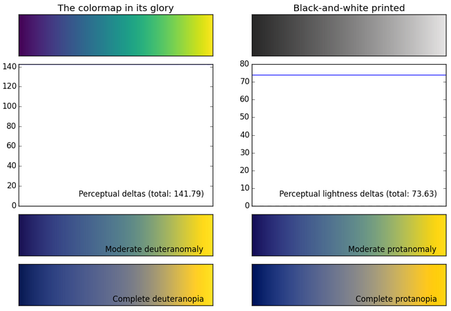

## Using a new color palette
fancy new Viridis




## using this new color palette in ggplot2

```{r}
library(viridis)
```


They were nice enough to include `ggplot2` specific functions:

```{r eval=FALSE}
scale_color_viridis()
```

## Applying Viridis to our graph

```{r, echo = FALSE}
g.virid <- ggplot(iris, aes(x = Sepal.Width, y = Petal.Width)) + 
  geom_point(aes(color = Species), size = 4, alpha = 0.5) +
  scale_color_viridis(option = "D", discrete = TRUE) + ggtitle("Viridis D")

g.virid
```
